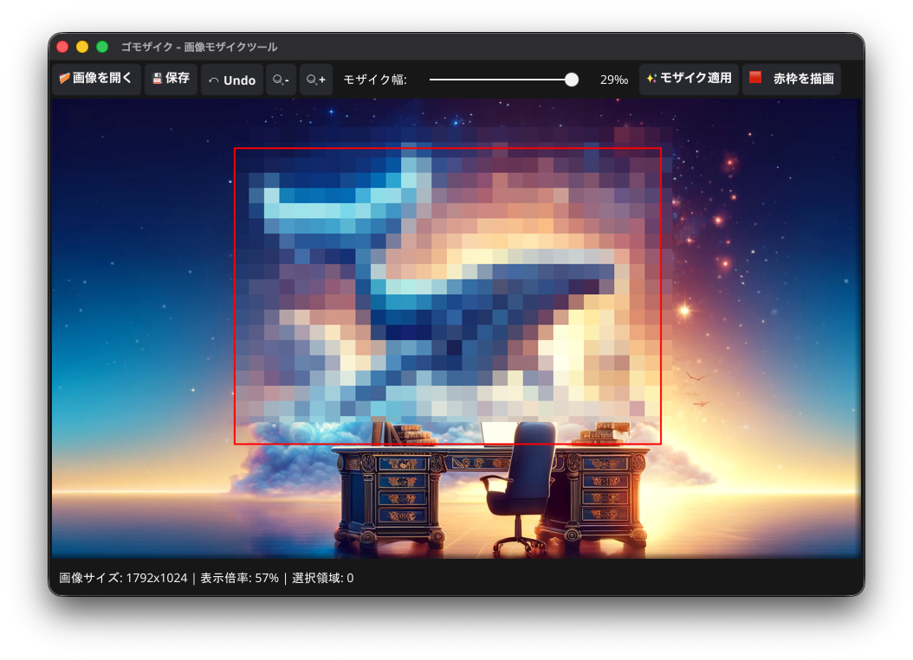

# ゴモザイク - 画像モザイクツール

画像の選択した部分にモザイクを掛けるデスクトップアプリケーションです。Go言語とGUIライブラリ [Fyne](https://fyne.io/) v2 で作られています。



## 機能

- **画像の読み込み**: PNG / JPEG に対応。ファイルダイアログのほか、ウィンドウへのドラッグ＆ドロップでも開けます
- **マウスで範囲選択**: ドラッグで矩形を作成。複数の領域を同時に選択できます
- **選択領域の編集**: 選択領域の内側をドラッグして移動、四隅のハンドルをドラッグしてリサイズ
- **モザイク幅の調整**: 画像の短辺に対する比率（5〜30‰）で指定。高解像度の画像ではブロック幅も自動的に大きくなります
- **履歴（元に戻す／やり直す）**: モザイク適用を最大20ステップまで遡れます
- **ズーム**: 拡大・縮小ボタン（1回あたり10%）。画像はドロップ時にウィンドウへフィット
- **画像の保存**: PNG / JPEG 形式（JPEG品質は90固定）。拡張子を省略すると `.png` で保存
- **設定の永続化**: 最後に使ったモザイク幅を次回起動時に復元
- **OS標準のファイルダイアログ**: Windows / macOS では標準の開く・保存ダイアログを使用（LinuxではFyne標準）

## 使い方

1. **画像を開く**: 「📁 画像を開く」をクリック、またはウィンドウに画像をドラッグ＆ドロップ
2. **領域を選択**: 画像上をドラッグしてモザイクを掛けたい範囲を囲みます（複数可）
   - 選択領域の内側をドラッグ: 移動
   - 選択領域の四隅をドラッグ: リサイズ
   - 選択領域の外側をクリック: 選択をすべてクリア
3. **モザイク幅を調整**（任意）: 「モザイク幅」スライダーで粗さを変更。値が大きいほど粗くなります
4. **適用**: 「✨ モザイク適用」をクリック。選択領域にモザイクが掛かり、選択はクリアされます
5. **保存**: 「💾 保存」をクリックして保存先を指定

### ツールバー

| ボタン | 動作 |
|---|---|
| 📁 画像を開く | 画像を読み込む |
| 💾 保存 | 現在の画像を保存する |
| ↶ Undo | 直前のモザイク適用を元に戻す |
| 🔍- / 🔍+ | 表示を縮小 / 拡大 |
| モザイク幅スライダー | モザイクのブロック幅（短辺比 5〜30‰） |
| ✨ モザイク適用 | 選択領域にモザイクを適用する |

### メニュー

- **ファイル**: 画像を開く / 保存
- **編集**: 取り消し（最後の選択を削除）/ 全クリア / 元に戻す / やり直す / モザイク適用
- **ヘルプ**: このアプリについて

ウィンドウ下部のステータスバーには、画像サイズ・表示倍率・選択領域数が表示されます。

## インストールと実行

### 前提条件

- Go 1.27.1 以降
- Fyne の動作に必要なCコンパイラとグラフィックス関連ライブラリ（詳細は [Fyne の Getting Started](https://docs.fyne.io/started/) を参照）

### 開発時に実行する

```bash
git clone <repository-url>
cd gomosaic

./run.sh      # macOS / Linux
run.bat       # Windows
```

または直接 `go run ./cmd/gomosaic` でも起動できます。

### 配布用にビルドする

```bash
./build.sh
```

`dist/` に次のものが生成されます。

| OS | 成果物 |
|---|---|
| macOS | `dist/gomosaic.app`（`open dist/gomosaic.app` で起動） |
| Linux | `dist/gomosaic` |
| Windows | `dist/gomosaic.exe` |

### テスト

```bash
go test ./...
```

## 設定ファイル

`~/.gomosaic/config.json` に、終了時のモザイク幅が保存されます。

```json
{
  "mosaic_block_size": 10
}
```

## プロジェクト構成

```
gomosaic/
├── cmd/gomosaic/main.go            # エントリーポイント
├── internal/
│   ├── app/app.go                  # アプリケーション起動・設定の読み書き
│   ├── config/config.go            # 設定ファイル (~/.gomosaic/config.json)
│   ├── ui/
│   │   ├── window.go               # メインウィンドウ・ツールバー・メニュー
│   │   ├── canvas.go               # 画像表示・範囲選択・移動/リサイズ
│   │   └── history.go              # 元に戻す/やり直しの履歴
│   ├── image/
│   │   ├── loader.go               # 画像読み込み
│   │   ├── saver.go                # 画像保存
│   │   └── mosaic.go               # モザイク処理（ブロック平均化）
│   ├── selection/selection.go      # 選択領域の管理
│   └── nativefiledialog/           # OS標準ファイルダイアログ (macOS / Windows)
├── build.sh / run.sh / run.bat     # ビルド・実行スクリプト
├── sample.png                      # 動作確認用のサンプル画像
└── AGENTS.md                       # 開発計画
```

## 既知の制限

- キーボードショートカットは未実装です
- 保存時のJPEG品質は固定（90）で、UIからは変更できません
- 非常に大きな画像ではモザイク適用に時間がかかることがあります
- macOSでビルド時にリンカー警告が出ることがありますが、動作には影響しません

## ライセンス

[MIT License](LICENSE)
